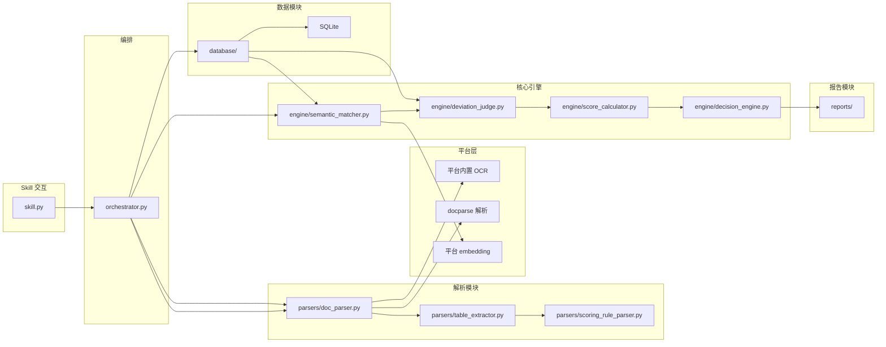
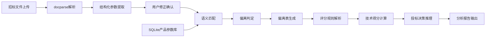

# 投标参数智能分析智能体 - 系统架构

## 概述

投标参数智能分析智能体是基于 MonkeyCode 平台开发的自主投标辅助系统，用于自动化招标文件技术参数评审。系统接收 PDF/Word 格式招标文件，通过平台内置 OCR 与 docparse 解析文档，提取结构化技术参数，与企业自有产品参数基准库进行语义比对和偏离判定，自动计算技术得分并输出投标决策建议，支持 Word/PDF 格式报告导出。

系统采用三层架构：**Agent 核心中枢层**（planner/scheduler/memory/exception_handler/self_validator）、**业务工具层**（parsers/engine/reports）和**基础设施层**（database/storage/config）。通过 MonkeyCode Skill SDK 以自然语言对话式交互对外提供服务。

## 技术栈

**语言与运行时**
- Python 3.10+

**框架与库**
- openpyxl - Excel 导入导出
- python-docx - Word 文档解析与生成
- Jinja2 - 报告模板渲染
- reportlab - PDF 生成
- numpy - 数值计算
- PyYAML - 配置文件解析

**数据存储**
- SQLite - 本地产品参数库

**外部能力**
- MonkeyCode 平台内置 OCR - 扫描件文字识别
- MonkeyCode docparse - PDF/Word 文档解析
- MonkeyCode 平台内置 embedding - 语义向量匹配

## 项目结构

```
bid-param-analyzer/
├── skill.py               # Agent 入口，集成核心中枢与平台适配
├── orchestrator.py        # 任务编排控制器
├── agent/                 # Agent 核心中枢层
│   ├── planner.py         # 自主任务规划引擎
│   ├── scheduler.py       # 多工具统一调度器
│   ├── memory.py          # 双层记忆系统
│   ├── exception_handler.py # 异常自主处理器
│   └── self_validator.py  # 结果自校验器
├── config/                # 配置文件
│   ├── settings.py        # 全局配置（阈值、路径、限制）
│   ├── product_lines.yaml # 产品线参数定义
│   └── scoring_templates/ # 评分模板
├── parsers/               # 文档解析模块
│   ├── doc_parser.py      # PDF/Word 解析适配
│   ├── table_extractor.py # 结构化参数提取
│   └── scoring_rule_parser.py # 评分规则解析
├── database/              # 数据层
│   ├── models.py          # SQLite 数据模型
│   ├── repository.py      # 数据 CRUD 操作
│   └── migrations.py      # 数据库初始化与迁移
├── engine/                # 核心引擎
│   ├── semantic_matcher.py # 语义参数匹配
│   ├── deviation_judge.py  # 偏离判定
│   ├── score_calculator.py # 得分计算
│   └── decision_engine.py  # 决策推理
├── reports/               # 报告生成
│   ├── deviation_table.py  # 偏离表生成
│   ├── analysis_report.py  # 投标分析报告
│   └── templates/          # Jinja2 模板
├── storage/               # 存储管理
│   ├── file_manager.py     # 文件临时存储
│   └── history_manager.py  # 历史任务管理
└── tests/                 # 测试
    ├── fixtures/           # 测试样例数据
    ├── test_parsers/
    └── test_engine/
```

**入口点**
- `skill.py` - Skill 主入口，接收用户消息与文件上传
- `orchestrator.py` - 任务编排，协调各模块执行

## 子系统

### Agent 核心中枢模块
**目的**: 自主任务规划、多工具调度、双层记忆管理、异常自主交互、结果自校验
**位置**: `agent/`
**关键文件**: `planner.py`, `scheduler.py`, `memory.py`, `exception_handler.py`, `self_validator.py`
**依赖**: 平台 Skill SDK、业务工具层所有模块
**被依赖**: Skill 交互层

#### 任务规划引擎 (`planner.py`)
- 意图解析: 从自然语言识别用户意图（全流程/资格门槛/性能参数/得分优先）
- 链路选择: 4 种预设模板（全流程、资格门槛、性能参数、得分优先）
- 计划生成: 按链路生成有序执行步骤序列
- 动态调整: 根据中间结果或异常反馈调整后续计划

#### 多工具调度器 (`scheduler.py`)
- 工具注册: 将各业务模块方法注册为可调度工具
- 统一执行: 按计划依次调用工具，注入记忆上下文
- 容错机制: 120s 超时自动重试 1 次
- 并行调度: 无依赖步骤支持线程并行执行
- 执行日志: 记录每次工具调用的输入/输出/耗时/异常

#### 双层记忆系统 (`memory.py`)
- 短期记忆 (SessionMemory): 当前任务上下文、用户修正、中间结果
- 长期记忆 (LongTermMemory): 项目历史记录、修正模式、参数别名、收藏模板（4 张 SQLite 表）
- 历史搜索: 按产品线/关键词检索历史项目与相似参数
- 别名建议: 基于历史修正自动推荐参数别名映射

#### 异常自主处理器 (`exception_handler.py`)
- 异常检测: 7 种异常类型（参数缺失、语义模糊、估值不符、格式错误、重复冲突、版本冲突、系统异常）
- 策略矩阵: retry_or_prompt / ask_user / skip_and_notify / ask_user_select / retry_or_skip / immediate_alert
- 询问构造: 基于上下文生成自然语言异常询问
- 高危预警: 评分决策阶段异常即时告警，阻断不合规输出

#### 结果自校验器 (`self_validator.py`)
- 覆盖率检查: 招标参数覆盖率 95%+、评分覆盖率 100%+
- 缺漏识别: 定位未匹配/未评分的参数条目
- 自动补跑: 触发缺失参数的补充匹配流程
- 校验报告: 生成完整性校验结果与质量评级

### 配置模块
**目的**: 管理全局配置项、产品线定义、评分模板
**位置**: `config/`
**关键文件**: `settings.py`, `product_lines.yaml`, `scoring_templates/default.json`
**依赖**: 无
**被依赖**: 所有其他模块

### 文档解析模块
**目的**: 解析招标文件（PDF/Word/扫描件），提取结构化参数
**位置**: `parsers/`
**关键文件**: `doc_parser.py`, `table_extractor.py`, `scoring_rule_parser.py`
**依赖**: 平台内置 OCR、docparse
**被依赖**: 任务编排控制器

### 数据库模块
**目的**: 管理产品参数基准库的持久化存储
**位置**: `database/`
**关键文件**: `models.py`, `repository.py`, `migrations.py`
**依赖**: SQLite
**被依赖**: 语义匹配、偏离判定

### 比对引擎模块
**目的**: 语义匹配、参数偏离判定、风险分级
**位置**: `engine/`
**关键文件**: `semantic_matcher.py`, `deviation_judge.py`
**依赖**: 平台内置 embedding、数据库模块
**被依赖**: 任务编排控制器

### 得分与决策模块
**目的**: 技术得分计算、投标决策推理、报告生成
**位置**: `engine/` + `reports/`
**关键文件**: `score_calculator.py`, `decision_engine.py`, `analysis_report.py`
**依赖**: 比对引擎模块、评分规则解析
**被依赖**: Skill 交互层

### 存储管理模块
**目的**: 招标文件临时存储、历史任务管理
**位置**: `storage/`
**关键文件**: `file_manager.py`, `history_manager.py`
**依赖**: 数据库模块
**被依赖**: Skill 交互层、任务编排控制器

## 架构图



## 数据流


