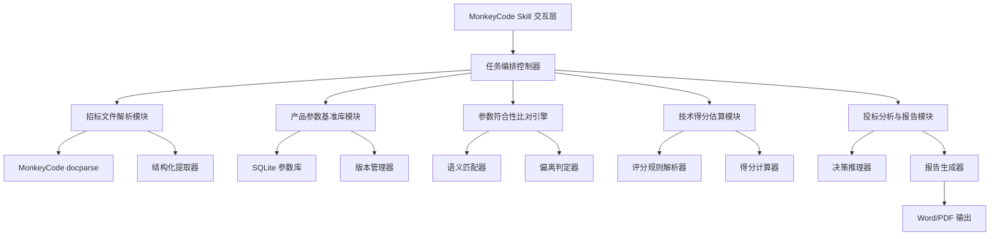
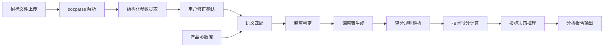
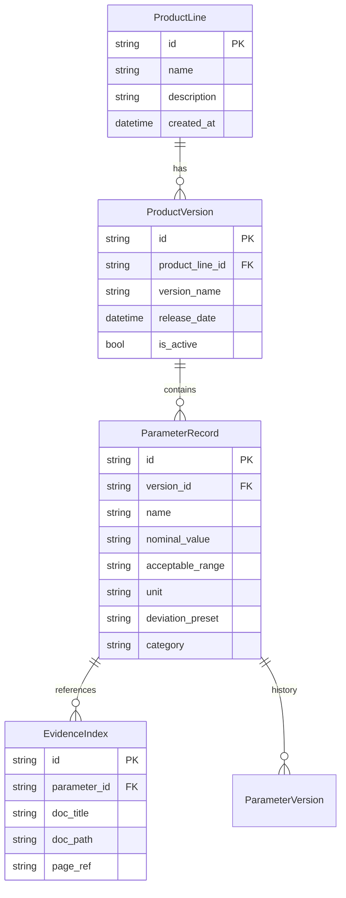
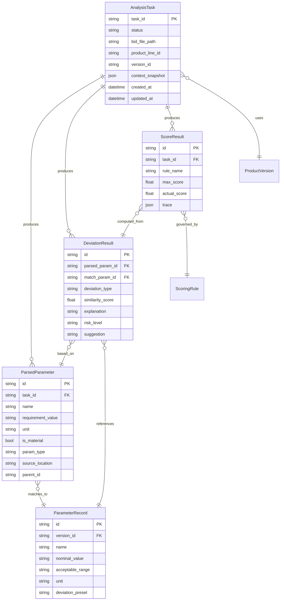

# 投标参数智能分析 Skill

Feature Name: bid-parameter-intelligent-analysis
Updated: 2026-06-28

---

## Description

投标参数智能分析 Skill 是运行于 MonkeyCode 平台上的智能投标辅助工具。采用 Python 技术栈构建核心分析引擎，SQLite 作为本地参数库存储，复用 MonkeyCode 平台 docparse 能力处理文档解析与 OCR。Skill 通过自然语言对话式交互引导用户完成招标文件上传、产品参数比对、技术得分估算、投标建议输出的全流程分析。

---

## Architecture

### 系统架构概览



### 数据流



### 目录结构

```
bid-param-analyzer/
├── skill.py                  # Skill 入口，MonkeyCode 平台适配
├── orchestrator.py           # 任务编排控制器
├── config/
│   ├── settings.py           # 全局配置
│   ├── product_lines.yaml    # 产品线定义
│   └── scoring_templates/    # 自定义评分模板
├── parsers/
│   ├── doc_parser.py         # 招标文件解析器（PDF/Word/OCR）
│   ├── table_extractor.py    # 表格精准识别
│   └── scoring_rule_parser.py # 评分细则解析器
├── database/
│   ├── models.py             # SQLite 数据模型定义
│   ├── repository.py         # 参数库 CRUD 操作
│   └── migrations.py         # 数据库迁移
├── engine/
│   ├── semantic_matcher.py   # 向量语义匹配
│   ├── deviation_judge.py    # 偏离状态判定
│   ├── score_calculator.py   # 技术得分计算
│   └── decision_engine.py    # 投标决策推理
├── reports/
│   ├── deviation_table.py    # 偏离表生成
│   ├── analysis_report.py    # 投标分析报告
│   └── templates/            # 报告模板
│       ├── deviation_table.docx.j2
│       └── analysis_report.docx.j2
├── storage/
│   ├── file_manager.py       # 招标文件临时存储管理
│   └── history_manager.py    # 历史项目管理
└── tests/
    ├── test_parsers/
    ├── test_engine/
    └── fixtures/             # 测试用例招标文件与参数库
```

---

## Components and Interfaces

### 1. Skill 交互层 (`skill.py`)

作为 MonkeyCode 平台 Skill 的入口点，负责：

- 接收用户自然语言指令并路由到对应的处理模块
- 管理对话上下文状态（当前步骤、已解析文件、已选产品线、中间结果等）
- 以表格、卡片等平台组件形式渲染分析结果
- 管理文件上传/下载交互

**接口：**

| 方法 | 说明 |
|------|------|
| `handle_message(user_input, context)` | 处理用户消息，返回响应与组件渲染指令 |
| `handle_file_upload(file_path, file_type)` | 处理招标文件上传 |
| `get_progress(task_id)` | 查询任务进度 |
| `modify_parameter(param_id, edits)` | 修正识别的参数条目 |
| `recalculate(task_id)` | 基于修正结果重新触发比对 |

---

### 2. 任务编排控制器 (`orchestrator.py`)

协调各模块按流程顺序执行，管理任务生命周期。

**接口：**

| 方法 | 说明 |
|------|------|
| `create_task(bid_file_path, product_line)` | 创建分析任务 |
| `execute_step(task_id, step_name)` | 执行指定步骤 |
| `get_task_state(task_id)` | 获取任务状态与中间结果 |
| `resume_task(task_id)` | 恢复历史任务 |

**任务状态机：**

```
PENDING → PARSING → PARSE_DONE → COMPARING → COMPARE_DONE
  → SCORING → SCORE_DONE → ANALYZING → COMPLETED
  任意步骤 → FAILED | CANCELLED
  PARSE_DONE → 用户修正 → PARSE_DONE (可重新进入比对)
```

---

### 3. 招标文件解析模块 (`parsers/`)

#### 3.1 文档解析器 (`doc_parser.py`)

**职责：** 调用 MonkeyCode docparse 能力完成 PDF/Word/扫描件的文本与表格提取。

**接口：**

| 方法 | 说明 |
|------|------|
| `parse_pdf(file_path)` | 解析 PDF 招标文件，返回全文文本与表格数据 |
| `parse_docx(file_path)` | 解析 Word 招标文件 |
| `detect_scan_type(file_path)` | 判断是否为扫描件，触发 OCR 路径 |
| `extract_tables(text)` | 从文本中提取所有表格，保持行列结构 |

#### 3.2 结构化提取器 (`table_extractor.py`)

**职责：** 基于章节模式匹配与布局分析，自动定位技术参数章节、评分细则表、资格门槛条款，输出结构化参数条目。

**接口：**

| 方法 | 说明 |
|------|------|
| `locate_key_sections(full_text)` | 定位三类关键区域，返回起始/结束位置 |
| `extract_parameters(section_text)` | 提取单个参数条目，返回结构化字段 |
| `extract_scoring_rules(rules_section)` | 提取评分细则 |
| `detect_star_items(params)` | 识别 * 号实质性条款 |

**参数条目数据模型：**

```python
@dataclass
class ParameterItem:
    id: str                    # 唯一标识
    name: str                  # 参数名称
    requirement_value: str     # 要求值
    unit: str                  # 单位
    is_material: bool          # 是否为实质性条款（*号）
    param_type: ParamType      # 数值/枚举/布尔/功能描述
    source_location: str       # 原文位置（页码/段落）
    parent_id: Optional[str]   # 父级参数 ID（层级关系）
    children: list[str]        # 子级参数 ID 列表
```

---

### 4. 产品参数基准库模块 (`database/`)

#### 4.1 数据模型 (`models.py`)



#### 4.2 仓库层 (`repository.py`)

| 方法 | 说明 |
|------|------|
| `get_active_params(product_line_id)` | 获取指定产品线当前活跃版本的参数列表 |
| `get_version_params(version_id)` | 获取指定版本的参数列表 |
| `switch_version(product_line_id, version_id)` | 切换活跃版本 |
| `import_from_excel(file_path)` | 批量导入 Excel 格式参数 |
| `export_to_excel(version_id, output_path)` | 导出为 Excel |
| `create_product_line(name, description)` | 新增产品线 |
| `update_parameter(param_id, updates)` | 更新单条参数 |
| `get_version_history(product_line_id)` | 获取版本历史列表 |

---

### 5. 参数符合性比对引擎 (`engine/`)

#### 5.1 语义匹配器 (`semantic_matcher.py`)

**职责：** 基于向量相似度将招标参数名称与产品库参数名称进行语义匹配，处理表述不一致问题。

**匹配策略：**

1. **精确匹配**：参数名称字符串完全一致时直接入库
2. **别名匹配**：查询产品库中预配置的参数名称别名列表
3. **向量匹配**：使用 embedding 模型计算余弦相似度，阈值≥0.85 判定为匹配
4. **人工兜底**：无法自动匹配（相似度<0.85）的参数标记为"待人工确认"

| 方法 | 说明 |
|------|------|
| `match_parameters(bid_params, product_params)` | 返回匹配对列表与未匹配项 |
| `calculate_similarity(name1, name2)` | 计算两个参数名称的语义相似度 |
| `add_alias(param_id, alias)` | 添加参数别名至知识库 |

#### 5.2 偏离判定器 (`deviation_judge.py`)

**职责：** 按参数类型执行对应的判定逻辑。

| 参数类型 | 判定逻辑 |
|---------|---------|
| 数值范围 | 投标值在要求范围内为无偏离，优于为正向，低于为负向 |
| 枚举值 | 投标值在枚举集合中为无偏离，否则为无法确认 |
| 布尔型 | 投标支持=无偏离，不支持=负偏离 |
| 功能描述 | 基于语义匹配与关键词覆盖判定，需人工复核 |

**偏离程度定义：**

- **正偏离**：投标产品参数显著优于招标要求
- **无偏离**：投标产品参数满足招标要求
- **负偏离**：投标产品参数低于招标要求
- **无法确认**：缺少证明材料或参数名称无法匹配

| 方法 | 说明 |
|------|------|
| `judge(bid_param, product_param)` | 单条参数偏离判定 |
| `batch_judge(matched_pairs)` | 批量判定，返回偏离表 |
| `classify_risk(deviation_result)` | 风险分级（废标级/扣分级） |

---

### 6. 技术得分估算模块 (`engine/`)

#### 6.1 评分规则解析器 (`scoring_rule_parser.py`)

**职责：** 从招标文件评分细则中提取结构化评分规则。

**评分规则模型：**

```python
@dataclass
class ScoringRule:
    id: str
    name: str
    max_score: float
    rule_type: RuleType          # QUANTITATIVE / QUALITATIVE
    conditions: list[Condition]   # 得分条件列表
    bonus_rules: list[BonusRule]  # 加分规则
    penalty_rules: list[PenaltyRule] # 扣分规则

@dataclass
class Condition:
    param_name: str
    operator: str                # EQ/GT/LT/GTE/LTE/CONTAINS
    target_value: str
    score: float
```

#### 6.2 得分计算器 (`score_calculator.py`)

| 方法 | 说明 |
|------|------|
| `calculate_scoring(scoring_rules, deviation_table)` | 计算所有评分项得分 |
| `calculate_item_score(rule, deviation)` | 计算单项评分项得分 |
| `aggregate_scores(item_scores)` | 汇总总分与得分率 |
| `mark_improvement_items(scores, deviation_table)` | 标记高价值提升项 |
| `trace_score(score_id)` | 得分溯源，返回评分标准、参数依据链路 |

---

### 7. 投标分析与报告模块 (`reports/`)

#### 7.1 决策推理器 (`decision_engine.py`)

**职责：** 综合偏离表、得分、风险清单进行决策推理。

**决策逻辑：**

```
建议投标：  废标风险=0 且 得分率≥80%
谨慎投标：  废标风险=0 且 得分率 60%-80% 或存在可消解风险
不建议投标：废标风险>0 或 得分率<60%
```

| 方法 | 说明 |
|------|------|
| `derive_decision(task_result)` | 输出三级决策结论与置信度 |
| `generate_advantage_list(deviation_table)` | 生成优势项清单（正偏离项） |
| `generate_risk_list(deviation_table, scores)` | 生成风险项清单 |
| `generate_suggestions(risk_list, improvement_items)` | 生成落地建议 |
| `competitive_assessment(deviation_table, scores)` | 竞争维度评估 |

#### 7.2 报告生成器 (`analysis_report.py`)

| 方法 | 说明 |
|------|------|
| `generate_deviation_table(task_id, output_format)` | 生成参数偏离表（Word/PDF） |
| `generate_full_report(task_id, output_format)` | 生成完整投标分析报告 |

---

### 8. 存储管理 (`storage/`)

#### 8.1 文件管理器 (`file_manager.py`)

- 招标文件临时上传存储，分析完成后 72 小时自动清理
- 用户可手动触发立即清除
- 支持本地目录 / 私有化存储路径配置

#### 8.2 历史管理器 (`history_manager.py`)

- 保存每次分析任务的完整上下文快照
- 支持按时间、项目名称、产品线检索历史记录
- 支持从历史记录恢复会话，复用参数比对结果

---

## Data Models

### 核心数据实体关系图



---

## Correctness Properties

### 关键不变式

1. **比对完整性**：每个从招标文件提取的参数条目在偏离表中均有对应记录
2. **版本一致性**：单次分析任务仅使用一个产品版本的所有参数，不跨版本混合
3. **得分合理性**：任意评分项的实际得分满足 0 ≤ actual_score ≤ max_score
4. **风险传递**：实质性条款负偏离必然导致决策结论为"不建议投标"
5. **数据隔离**：不同任务的招标文件、分析结果互相隔离

### 输入校验规则

- 招标文件校验：检查文件扩展名、文件大小上限（200MB）、页数上限（200页）
- 参数库校验：Excel 导入时校验必填字段完整性、数值字段类型合法性
- 上传文件类型白名单：`.pdf` `.doc` `.docx` `.xlsx` `.xls`

---

## Error Handling

| 场景 | 处理策略 |
|------|---------|
| 招标文件解析失败 | 返回具体错误原因（文件损坏、格式不支持、页数超限），提示用户重新上传 |
| OCR 识别质量过低 | 标记为低置信度区域，提示用户人工复核原文 |
| 语义匹配无结果 | 生成未匹配清单，引导用户手动映射参数 |
| 产品线无活跃版本 | 提示管理员导入参数数据后再操作 |
| 得分规则无法解析 | 使用默认规则模板兜底，标记为"需人工确认评分细则" |
| 报告导出失败 | 重试 3 次后返回错误，提供原始数据下载 |
| 任务执行超时 | 返回已完成步骤的中间结果，支持断点续算 |
| 文件存储空间不足 | 清理过期临时文件后重试，仍然不足则拒绝上传并提示 |

所有用户可见错误消息 SHALL 包含：
- 错误类别（解析/比对/得分/系统）
- 简要原因说明
- 建议操作

---

## Test Strategy

### 测试层级

| 层级 | 范围 | 工具 |
|------|------|------|
| 单元测试 | 每个模块的公共方法 | pytest |
| 集成测试 | 模块间接口调用与数据流 | pytest |
| 端到端测试 | Skill 完整调用链路 | pytest + mock skill context |
| 安全扫描 | 代码漏洞检测 | MonkeyScan |

### 测试数据

- `tests/fixtures/bid_docs/` — 多格式招标文件样本
  - `standard.pdf` (规范 PDF)
  - `scanned.pdf` (扫描件 PDF)
  - `complex_table.docx` (含多层表格的 Word)
  - `no_section.docx` (无明确章节标注的 Word)
- `tests/fixtures/product_db/` — 预置产品参数库
  - `product_line_a.xlsx` (完整参数库)
  - `product_line_b_empty.xlsx` (空参数库，边界测试)
- `tests/fixtures/scoring_rules/` — 评分规则样本

### 关键测试用例

1. **文档解析**：PDF 文本提取、Word 表格提取、扫描件 OCR、章节定位准确性、* 号条款识别
2. **参数库**：CRUD 操作、版本切换、Excel 导入/导出、字段校验
3. **语义匹配**：精确匹配、别名匹配、向量相似度匹配、低相似度未匹配
4. **偏离判定**：四种参数类型的正向/负向/无偏离/无法确认
5. **得分计算**：定量打分、定性打分、加分/扣分、汇总逻辑
6. **决策推理**：三种建议结论的边界条件
7. **报告导出**：Word 格式、PDF 格式、内容完整性验证
8. **完整性约束**：比对覆盖率、风险传递逻辑、版本隔离

---

## References

[^1]: 当前工作区 `/README.md` — 项目入口说明
[^2]: 当前工作区 `.monkeycode/specs/bid-parameter-intelligent-analysis/requirements.md` — 需求规格文档
[^3]: MonkeyCode 平台 Skill 开发文档 — 平台内置文档，运行时可用
