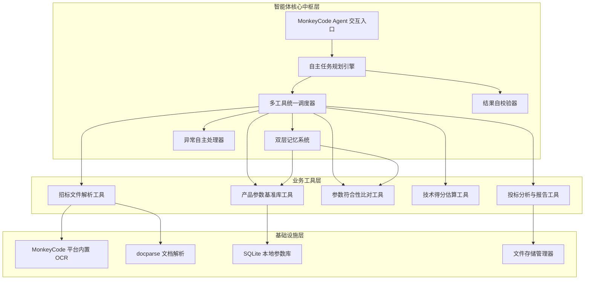
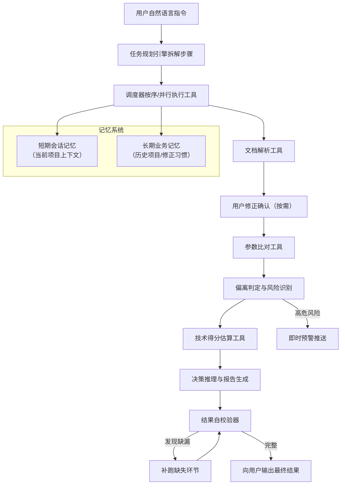
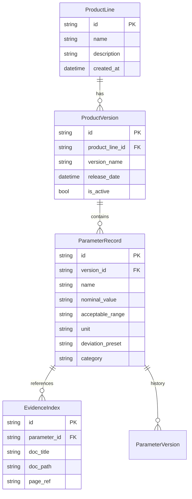
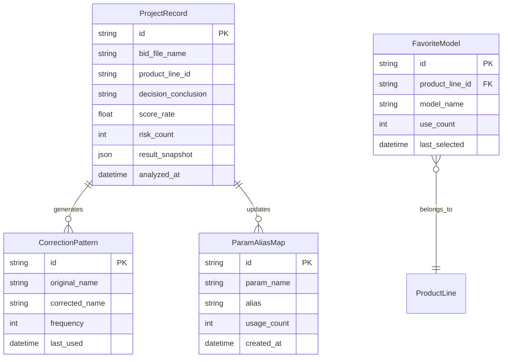
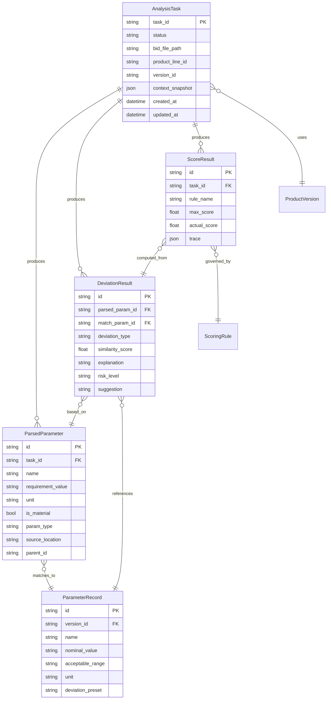

# 投标参数智能分析智能体

Feature Name: bid-parameter-intelligent-analysis
Updated: 2026-06-28

---

## Description

投标参数智能分析智能体（Bid Analysis Agent）是运行于 MonkeyCode 平台上的自主投标辅助智能体。采用 Python 技术栈构建核心分析引擎，SQLite 作为本地参数库存储，复用 MonkeyCode 平台内置 OCR 能力与 docparse 处理文档解析。

本智能体超越传统固定流程 Skill，核心差异在于：
- **自主任务规划**：根据用户指令与文件内容动态拆解执行链路，按需裁剪步骤
- **多工具统一调度**：纳管全部业务工具，支持顺序/并行执行与失败自动重试
- **双层记忆系统**：短期会话记忆维持多轮上下文，长期业务记忆复用历史经验
- **异常主动交互**：识别信息缺漏时定向询问，高危风险即时预警
- **结果自校验**：全流程完成后自主检查完整性与覆盖率，发现缺漏自动补跑

---

## Architecture

### 系统架构概览



### 智能体执行流



### 目录结构

```
bid-param-analyzer/
├── skill.py                  # Agent 入口，MonkeyCode 平台适配
├── orchestrator.py           # 任务编排控制器
├── agent/                    # [新增] 智能体核心中枢
│   ├── planner.py            # 自主任务规划引擎
│   ├── scheduler.py          # 多工具统一调度器
│   ├── memory.py             # 双层记忆系统
│   ├── exception_handler.py  # 异常自主处理器
│   └── self_validator.py     # 结果自校验器
├── config/
│   ├── settings.py           # 全局配置
│   ├── product_lines.yaml    # 产品线定义
│   └── scoring_templates/    # 自定义评分模板
├── parsers/
│   ├── doc_parser.py         # 招标文件解析器（PDF/Word/OCR）
│   ├── table_extractor.py    # 表格精准识别
│   └── scoring_rule_parser.py # 评分细则解析器
├── database/
│   ├── models.py             # SQLite 数据模型定义
│   ├── repository.py         # 参数库 CRUD 操作
│   └── migrations.py         # 数据库迁移
├── engine/
│   ├── semantic_matcher.py   # 向量语义匹配
│   ├── deviation_judge.py    # 偏离状态判定
│   ├── score_calculator.py   # 技术得分计算
│   └── decision_engine.py    # 投标决策推理
├── reports/
│   ├── deviation_table.py    # 偏离表生成
│   ├── analysis_report.py    # 投标分析报告
│   └── templates/            # 报告模板
│       ├── deviation_table.docx.j2
│       └── analysis_report.docx.j2
├── storage/
│   ├── file_manager.py       # 招标文件临时存储管理
│   └── history_manager.py    # 历史项目管理
└── tests/
    ├── test_parsers/
    ├── test_engine/
    └── fixtures/             # 测试用例招标文件与参数库
```

---

## Components and Interfaces

### 1. Agent 交互入口 (`skill.py`)

作为 MonkeyCode 平台 Agent 的入口点，负责：

- 接收用户自然语言指令并委托任务规划引擎拆解为执行链路
- 管理对话上下文状态（当前步骤、已解析文件、已选产品线、中间结果等）
- 以表格、卡片、风险预警弹窗等平台组件形式渲染分析结果
- 管理文件上传/下载交互

**接口：**

| 方法 | 说明 |
|------|------|
| `handle_message(user_input, context)` | 处理用户消息，委托规划引擎生成任务计划并返回响应 |
| `handle_file_upload(file_path, file_type)` | 处理招标文件上传 |

---

### 2. 自主任务规划引擎 (`agent/planner.py`)

**职责：** 将用户自然语言指令拆解为工具调用序列，在运行时动态调整执行路径。

**规划策略：**

1. **指令解析**：从用户输入中提取意图关键词，识别是否包含范围限定（如"只分析资格门槛"）、条件筛选
2. **模板映射**：匹配预设执行链路模板（全流程/资格门槛/性能参数/得分优先），按需合并裁剪
3. **上下文感知**：读取短期记忆中的已有结果，跳过已完成步骤，仅规划增量步骤
4. **动态调整**：执行过程中根据工具返回结果（如无评分表 → 跳过打分步骤）动态变更后续路径

**接口：**

| 方法 | 说明 |
|------|------|
| `parse_intent(user_input, context)` | 解析用户意图，返回结构化任务目标 |
| `generate_plan(intent, memory)` | 生成初始执行计划（步骤序列 + 依赖关系） |
| `adjust_plan(plan, step_result)` | 根据中间结果动态调整后续步骤 |
| `next_step(plan)` | 返回下一个待执行步骤 |

**链路模板：**

```
全流程模板: 文档解析 → 参数提取 → 产品匹配 → 语义比对 → 偏离判定 → 得分计算 → 风险分析 → 报告生成 → 自校验
资格门槛模板: 文档解析 → 资格门槛识别 → 偏离判定 → 风险报告
性能参数模板: 文档解析 → 性能参数提取 → 语义比对 → 偏离判定 → 得分计算 → 优化建议
得分优先模板: 文档解析 → 评分表提取 → 参数比对 → 得分计算 → 敏感度分析 → 提升方案
```

---

### 3. 多工具统一调度器 (`agent/scheduler.py`)

**职责：** 按任务规划引擎生成的执行计划，统一纳管并调度所有业务工具的调用。

**调度策略：**

1. **注册发现**：启动时扫描并注册所有可用工具，维护工具能力描述与参数签名
2. **顺序执行**：有数据依赖关系的工具依序调用，前驱完成后传递结果给后继
3. **并行调度**：无依赖关系的工具（如同时解析多个附件）可并行执行
4. **失败重试**：工具调用返回异常时自动调整参数重试一次，重试失败触发异常交互处理器
5. **超时控制**：每个工具调用预设超时阈值，超时后降级处理或转移至人工确认

**接口：**

| 方法 | 说明 |
|------|------|
| `register_tool(name, handler, signature)` | 注册工具 |
| `execute_step(step, context)` | 执行单个计划步骤 |
| `execute_plan(plan, context)` | 按计划依序/并行执行全部步骤 |
| `retry_step(step, context, strategy)` | 以指定策略重试失败步骤 |
| `get_execution_log()` | 获取工具调用日志 |

**工具注册表：**

| 工具名 | 模块 | 依赖 |
|--------|------|------|
| `doc_parser` | `parsers/doc_parser.py` | 无 |
| `table_extractor` | `parsers/table_extractor.py` | `doc_parser` |
| `scoring_rule_parser` | `parsers/scoring_rule_parser.py` | `doc_parser` |
| `semantic_matcher` | `engine/semantic_matcher.py` | `table_extractor`, `product_db` |
| `deviation_judge` | `engine/deviation_judge.py` | `semantic_matcher` |
| `score_calculator` | `engine/score_calculator.py` | `scoring_rule_parser`, `deviation_judge` |
| `decision_engine` | `engine/decision_engine.py` | `deviation_judge`, `score_calculator` |
| `report_generator` | `reports/` | `deviation_judge`, `score_calculator`, `decision_engine` |

---

### 4. 双层记忆系统 (`agent/memory.py`)

**职责：** 管理短期会话上下文与长期业务知识，支持上下文复用与经验累积。

#### 4.1 短期会话记忆

存储结构（内存字典，会话期间存活）：

```python
@dataclass
class SessionMemory:
    task_id: str
    parsed_params: list[ParameterItem]     # 当前招标参数
    user_corrections: dict[str, dict]      # 用户修正记录
    matched_pairs: list[MatchPair]         # 匹配结果
    deviation_results: list[DeviationResult]
    score_results: list[ScoreResult]
    decision: DecisionResult
    pending_queries: list[str]             # 待确认事项
```

#### 4.2 长期业务记忆

存储结构（SQLite 表，持久化保存）：

```python
@dataclass
class LongTermMemory:
    project_history: list[ProjectRecord]   # 历史投标项目
    correction_patterns: dict              # 用户修正习惯统计
    param_alias_map: dict[str, list[str]]  # 参数名称→历史别名映射
    favorite_models: list[str]             # 常用产品型号
    rule_templates: list[ScoringTemplate]  # 保存的评分模板
```

**接口：**

| 方法 | 说明 |
|------|------|
| `save_session_context(task_id, context)` | 保存当前会话上下文 |
| `load_session_context(task_id)` | 恢复会话上下文 |
| `record_correction(param_name, old_val, new_val)` | 记录用户修正，更新习惯统计 |
| `search_history(keywords)` | 检索历史投标项目 |
| `get_alias_suggestions(param_name)` | 获取历史别名建议 |
| `reuse_rules(product_line)` | 获取该产品线历史匹配规则 |
| `export_memory()` | 导出长期记忆数据 |
| `clear_memory(scope)` | 清除指定范围的记忆 |

---

### 5. 异常自主处理器 (`agent/exception_handler.py`)

**职责：** 在工具调用失败或结果不满足预期时，自主判断处理策略并主动与用户交互。

**处理策略矩阵：**

| 异常类型 | 检测条件 | 处理策略 |
|----------|---------|---------|
| 文档解析失败 | 工具返回空文本或异常 | 提示用户检查文件格式，尝试备选解析路径 |
| 参数匹配度过低 | 匹配覆盖率 < 60% | 列出未匹配参数清单，引导手动映射 |
| 缺失评分表 | 评分规则解析返回空 | 标记为无评分模式，跳过得分计算 |
| 产品型号不明确 | 多产品线命中 | 列出候选产品线，请求用户指定 |
| 资质门槛缺项 | 关键资质无对应参数 | 标记为待确认项，生成缺项清单 |
| 工具超时 | 调用超时 3 次 | 返回已完成步骤结果，提示断点续算 |
| 高危风险预警 | 实质性条款负偏离 | 即时推送预警，不等全流程结束 |

**接口：**

| 方法 | 说明 |
|------|------|
| `detect_anomaly(step, result)` | 检测是否触发异常条件 |
| `resolve_strategy(anomaly_type)` | 返回处理策略（重试/询问/跳过/终止） |
| `formulate_query(anomaly_type, detail)` | 生成面向用户的定向询问 |
| `apply_resolution(anomaly_type, user_input)` | 应用用户反馈恢复执行 |

---

### 6. 结果自校验器 (`agent/self_validator.py`)

**职责：** 全流程完成后自主检查结果完整性与覆盖率，发现缺漏自动触发补跑。

**校验维度：**

1. **参数覆盖率**：`已匹配参数数 / 招标参数总数`
2. **评分项覆盖率**：`已打分评分项 / 识别到的评分规则总数`
3. **风险完整性**：所有实质性条款均有偏离判定
4. **数据一致性**：偏离表、得分表、报告中的数值一致
5. **异常标记完整性**：无法确认的参数均保留人工复核标记

**接口：**

| 方法 | 说明 |
|------|------|
| `validate_completeness(task_id)` | 执行全部校验维度，返回校验报告 |
| `check_param_coverage(task_id)` | 检查参数匹配覆盖率 |
| `check_score_coverage(task_id)` | 检查评分项覆盖率 |
| `identify_missing_items(task_id)` | 识别未完成项清单 |
| `trigger_remediation(missing_items, scheduler)` | 自动触发补跑缺失环节 |
| `generate_validation_report(task_id)` | 生成自校验报告 |

### 7. 任务状态机 (`orchestrator.py`)

维护分析任务的生命周期状态，由调度器驱动状态流转，各业务工具在执行完成后更新对应状态。

**接口：**

| 方法 | 说明 |
|------|------|
| `create_task(bid_file_path, product_line)` | 创建分析任务 |
| `update_state(task_id, new_state)` | 更新任务状态 |
| `get_task_state(task_id)` | 获取任务状态与中间结果 |
| `resume_task(task_id)` | 恢复历史任务 |
| `store_intermediate(task_id, data)` | 存储中间结果

**任务状态机：**

```
PENDING → PARSING → PARSE_DONE → COMPARING → COMPARE_DONE
  → SCORING → SCORE_DONE → ANALYZING → COMPLETED
  任意步骤 → FAILED | CANCELLED
  PARSE_DONE → 用户修正 → PARSE_DONE (可重新进入比对)
```

---

### 8. 招标文件解析模块 (`parsers/`)

#### 8.1 文档解析器 (`doc_parser.py`)

**职责：** 调用 MonkeyCode 平台内置 OCR 与 docparse 能力完成 PDF/Word/扫描件的文本与表格提取。

**接口：**

| 方法 | 说明 |
|------|------|
| `parse_pdf(file_path)` | 解析 PDF 招标文件，返回全文文本与表格数据 |
| `parse_docx(file_path)` | 解析 Word 招标文件 |
| `detect_scan_type(file_path)` | 判断是否为扫描件，触发 OCR 路径 |
| `extract_tables(text)` | 从文本中提取所有表格，保持行列结构 |

#### 8.2 结构化提取器 (`table_extractor.py`)

**职责：** 基于章节模式匹配与布局分析，自动定位技术参数章节、评分细则表、资格门槛条款，输出结构化参数条目。

**接口：**

| 方法 | 说明 |
|------|------|
| `locate_key_sections(full_text)` | 定位三类关键区域，返回起始/结束位置 |
| `extract_parameters(section_text)` | 提取单个参数条目，返回结构化字段 |
| `extract_scoring_rules(rules_section)` | 提取评分细则 |
| `detect_star_items(params)` | 识别 * 号实质性条款 |

**参数条目数据模型：**

```python
@dataclass
class ParameterItem:
    id: str                    # 唯一标识
    name: str                  # 参数名称
    requirement_value: str     # 要求值
    unit: str                  # 单位
    is_material: bool          # 是否为实质性条款（*号）
    param_type: ParamType      # 数值/枚举/布尔/功能描述
    source_location: str       # 原文位置（页码/段落）
    parent_id: Optional[str]   # 父级参数 ID（层级关系）
    children: list[str]        # 子级参数 ID 列表
```

---

### 9. 产品参数基准库模块 (`database/`)

#### 9.1 数据模型 (`models.py`)



#### 9.2 仓库层 (`repository.py`)

| 方法 | 说明 |
|------|------|
| `get_active_params(product_line_id)` | 获取指定产品线当前活跃版本的参数列表 |
| `get_version_params(version_id)` | 获取指定版本的参数列表 |
| `switch_version(product_line_id, version_id)` | 切换活跃版本 |
| `import_from_excel(file_path)` | 批量导入 Excel 格式参数 |
| `export_to_excel(version_id, output_path)` | 导出为 Excel |
| `create_product_line(name, description)` | 新增产品线 |
| `update_parameter(param_id, updates)` | 更新单条参数 |
| `get_version_history(product_line_id)` | 获取版本历史列表 |

---

### 10. 参数符合性比对工具 (`engine/`)

#### 10.1 语义匹配器 (`semantic_matcher.py`)

**职责：** 基于向量相似度将招标参数名称与产品库参数名称进行语义匹配，处理表述不一致问题。

**匹配策略：**

1. **精确匹配**：参数名称字符串完全一致时直接入库
2. **别名匹配**：查询产品库中预配置的参数名称别名列表
3. **向量匹配**：使用 embedding 模型计算余弦相似度，阈值≥0.85 判定为匹配
4. **人工兜底**：无法自动匹配（相似度<0.85）的参数标记为"待人工确认"

| 方法 | 说明 |
|------|------|
| `match_parameters(bid_params, product_params)` | 返回匹配对列表与未匹配项 |
| `calculate_similarity(name1, name2)` | 计算两个参数名称的语义相似度 |
| `add_alias(param_id, alias)` | 添加参数别名至知识库 |

#### 10.2 偏离判定器 (`deviation_judge.py`)

**职责：** 按参数类型执行对应的判定逻辑。

| 参数类型 | 判定逻辑 |
|---------|---------|
| 数值范围 | 投标值在要求范围内为无偏离，优于为正向，低于为负向 |
| 枚举值 | 投标值在枚举集合中为无偏离，否则为无法确认 |
| 布尔型 | 投标支持=无偏离，不支持=负偏离 |
| 功能描述 | 基于语义匹配与关键词覆盖判定，需人工复核 |

**偏离程度定义：**

- **正偏离**：投标产品参数显著优于招标要求
- **无偏离**：投标产品参数满足招标要求
- **负偏离**：投标产品参数低于招标要求
- **无法确认**：缺少证明材料或参数名称无法匹配

| 方法 | 说明 |
|------|------|
| `judge(bid_param, product_param)` | 单条参数偏离判定 |
| `batch_judge(matched_pairs)` | 批量判定，返回偏离表 |
| `classify_risk(deviation_result)` | 风险分级（废标级/扣分级） |

---

### 11. 技术得分估算工具 (`engine/`)

#### 11.1 评分规则解析器 (`scoring_rule_parser.py`)

**职责：** 从招标文件评分细则中提取结构化评分规则。

**评分规则模型：**

```python
@dataclass
class ScoringRule:
    id: str
    name: str
    max_score: float
    rule_type: RuleType          # QUANTITATIVE / QUALITATIVE
    conditions: list[Condition]   # 得分条件列表
    bonus_rules: list[BonusRule]  # 加分规则
    penalty_rules: list[PenaltyRule] # 扣分规则

@dataclass
class Condition:
    param_name: str
    operator: str                # EQ/GT/LT/GTE/LTE/CONTAINS
    target_value: str
    score: float
```

#### 11.2 得分计算器 (`score_calculator.py`)

| 方法 | 说明 |
|------|------|
| `calculate_scoring(scoring_rules, deviation_table)` | 计算所有评分项得分 |
| `calculate_item_score(rule, deviation)` | 计算单项评分项得分 |
| `aggregate_scores(item_scores)` | 汇总总分与得分率 |
| `mark_improvement_items(scores, deviation_table)` | 标记高价值提升项 |
| `trace_score(score_id)` | 得分溯源，返回评分标准、参数依据链路 |

---

### 12. 投标分析与报告工具 (`reports/`)

#### 12.1 决策推理器 (`decision_engine.py`)

**职责：** 综合偏离表、得分、风险清单进行决策推理。

**决策逻辑：**

```
建议投标：  废标风险=0 且 得分率≥80%
谨慎投标：  废标风险=0 且 得分率 60%-80% 或存在可消解风险
不建议投标：废标风险>0 或 得分率<60%
```

| 方法 | 说明 |
|------|------|
| `derive_decision(task_result)` | 输出三级决策结论与置信度 |
| `generate_advantage_list(deviation_table)` | 生成优势项清单（正偏离项） |
| `generate_risk_list(deviation_table, scores)` | 生成风险项清单 |
| `generate_suggestions(risk_list, improvement_items)` | 生成落地建议 |
| `competitive_assessment(deviation_table, scores)` | 竞争维度评估 |

#### 12.2 报告生成器 (`analysis_report.py`)

| 方法 | 说明 |
|------|------|
| `generate_deviation_table(task_id, output_format)` | 生成参数偏离表（Word/PDF） |
| `generate_full_report(task_id, output_format)` | 生成完整投标分析报告 |

---

### 13. 存储管理 (`storage/`)

#### 13.1 文件管理器 (`file_manager.py`)

- 招标文件临时上传存储，分析完成后 72 小时自动清理
- 用户可手动触发立即清除
- 支持本地目录 / 私有化存储路径配置

#### 13.2 历史管理器 (`history_manager.py`)

- 保存每次分析任务的完整上下文快照
- 支持按时间、项目名称、产品线检索历史记录
- 支持从历史记录恢复会话，复用参数比对结果

---

## Data Models

### 长期记忆数据模型





---

## Correctness Properties

### 关键不变式

1. **比对完整性**：每个从招标文件提取的参数条目在偏离表中均有对应记录
2. **版本一致性**：单次分析任务仅使用一个产品版本的所有参数，不跨版本混合
3. **得分合理性**：任意评分项的实际得分满足 0 ≤ actual_score ≤ max_score
4. **风险传递**：实质性条款负偏离必然导致决策结论为"不建议投标"
5. **数据隔离**：不同任务的招标文件、分析结果互相隔离
6. **执行链完整性**：调度器执行的步骤序列必须对应规划引擎生成的有效计划，不执行计划外步骤
7. **自校验闭环**：报告输出前必须经过自校验器检查，参数覆盖率低于阈值时自动触发补跑
8. **记忆一致性**：用户修正操作必须同步更新短期记忆与长期纠正模式记录
9. **异常不可静默**：任何工具调用异常必须被异常处理器捕获并记录，不允许无日志静默失败

### 输入校验规则

- 招标文件校验：检查文件扩展名、文件大小上限（200MB）、页数上限（200页）
- 参数库校验：Excel 导入时校验必填字段完整性、数值字段类型合法性
- 上传文件类型白名单：`.pdf` `.doc` `.docx` `.xlsx` `.xls`

---

## Error Handling

| 场景 | 处理策略 |
|------|---------|
| 招标文件解析失败 | 返回具体错误原因（文件损坏、格式不支持、页数超限），提示用户重新上传 |
| OCR 识别质量过低 | 标记为低置信度区域，提示用户人工复核原文 |
| 语义匹配无结果 | 生成未匹配清单，引导用户手动映射参数 |
| 产品线无活跃版本 | 提示管理员导入参数数据后再操作 |
| 得分规则无法解析 | 使用默认规则模板兜底，标记为"需人工确认评分细则" |
| 报告导出失败 | 重试 3 次后返回错误，提供原始数据下载 |
| 任务执行超时 | 返回已完成步骤的中间结果，支持断点续算 |
| 文件存储空间不足 | 清理过期临时文件后重试，仍然不足则拒绝上传并提示 |
| 任务规划失败 | 回退至默认全流程模板，告知用户正在使用标准路径执行 |
| 工具连续重试均失败 | 跳过该步骤，标记为"待人工处理"，继续执行后续可执行的步骤 |
| 自校验发现参数覆盖率不足 | 自动降低匹配阈值到 0.7 重试，仍不足则输出未匹配清单请用户确认 |
| 长期记忆存储异常 | 降级为仅短期记忆模式，提示用户本次分析不会纳入历史经验 |

所有用户可见错误消息 SHALL 包含：
- 错误类别（解析/比对/得分/系统）
- 简要原因说明
- 建议操作

---

## Test Strategy

### 测试层级

| 层级 | 范围 | 工具 |
|------|------|------|
| 单元测试 | 每个模块（含 agent 核心组件）的公共方法 | pytest |
| 集成测试 | 模块间接口调用与数据流 | pytest |
| 智能体测试 | Agent 完整规划→调度→自校验链路 | pytest + mock |
| 端到端测试 | 用户上传文件到报告输出的全流程 | pytest + mock skill context |
| 安全扫描 | 代码漏洞检测 | MonkeyScan |

### 新增智能体核心测试用例

1. **任务规划**：全流程模板生成、空洞指令裁剪、多产品选型中断、定制指令解析
2. **工具调度**：顺序执行正确性、并行执行无冲突、失败重试->放弃->跳过链路、超时降级
3. **记忆系统**：短期记忆读写、修正触发记忆更新、长期匹配规则复用、历史项目检索
4. **异常处理**：参数匹配度低触发询问、产品不明确列出选项、高危风险即时预警、用户反馈恢复执行
5. **自校验**：参数覆盖率检查、评分覆盖率检查、缺漏补跑触发、校验报告生成

### 测试数据

- `tests/fixtures/bid_docs/` — 多格式招标文件样本
  - `standard.pdf` (规范 PDF)
  - `scanned.pdf` (扫描件 PDF)
  - `complex_table.docx` (含多层表格的 Word)
  - `no_section.docx` (无明确章节标注的 Word)
- `tests/fixtures/product_db/` — 预置产品参数库
  - `product_line_a.xlsx` (完整参数库)
  - `product_line_b_empty.xlsx` (空参数库，边界测试)
- `tests/fixtures/scoring_rules/` — 评分规则样本

### 关键测试用例

1. **文档解析**：PDF 文本提取、Word 表格提取、扫描件 OCR、章节定位准确性、* 号条款识别
2. **参数库**：CRUD 操作、版本切换、Excel 导入/导出、字段校验
3. **语义匹配**：精确匹配、别名匹配、向量相似度匹配、低相似度未匹配
4. **偏离判定**：四种参数类型的正向/负向/无偏离/无法确认
5. **得分计算**：定量打分、定性打分、加分/扣分、汇总逻辑
6. **决策推理**：三种建议结论的边界条件
7. **报告导出**：Word 格式、PDF 格式、内容完整性验证
8. **完整性约束**：比对覆盖率、风险传递逻辑、版本隔离

---

## References

[^1]: 当前工作区 `/README.md` — 项目入口说明
[^2]: 当前工作区 `.monkeycode/specs/bid-parameter-intelligent-analysis/requirements.md` — 需求规格文档
[^3]: MonkeyCode 平台 Skill 开发文档 — 平台内置文档，运行时可用
